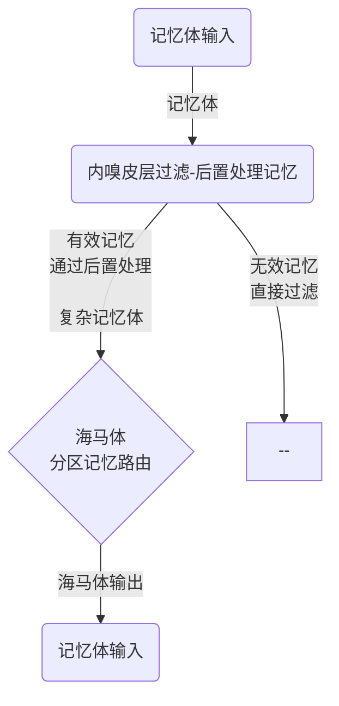

# hippocampus
仿生记忆存储实验

## 记忆存储流程：

```mermaid
graph TD;
    A(记忆体输入)-->|记忆体|B(内嗅皮层过滤-后置处理记忆);
    B-->|有效记忆\n通过后置处理\n\n复杂记忆体|C{海马体\n分区记忆路由};
    B-->|无效记忆\n直接过滤|D[--];
    C-->|海马体输出|E(记忆体输入);    
```
